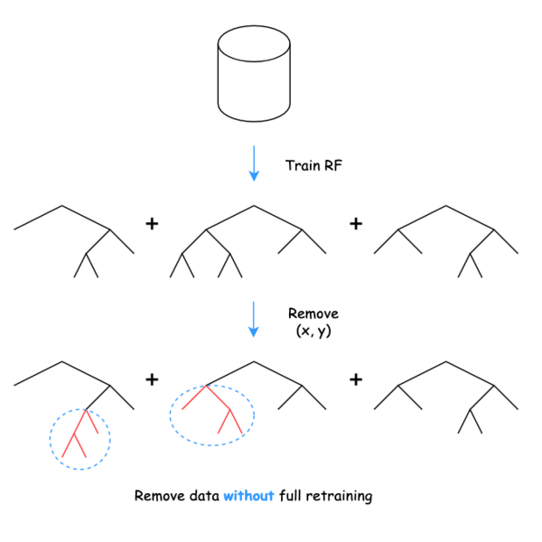

DaRE RF
---

**DaRE** (**Da**ta **R**emoval-**E**nabled) RF is a variant of random forests that enables the _efficient_ removal of training data without having to retrain from scratch.

<p align="center">
	
</p>

Install
---
1. Install Python 3.7+.
1. Install dependencies and compile project. Run `make all`.

Simple Example
---

```
import dare
import numpy as np

# initialize some training data
X = np.array([[0, 1], [0, 1], [0, 1], [1, 0], [1, 0]])
y = np.array([1, 1, 1, 0, 1])

# create a test example
X_test = np.array([[1, 0]])

# train a DaRE RF model
rf = dare.Forest(n_estimators=100,
                 max_depth=3,
                 k=5,  # no. thresholds to consider per attribute
                 topd=0,  # no. random node layers
                 random_state=1)
rf.fit(X, y)

# prediction before deletion => [0.5, 0.5]
rf.predict_proba(X_test)

# delete training example at index 3 ([1, 0], 0)
rf.delete(3)

# prediction after deletion => [0.0, 1.0]
rf.predict_proba(X_test)
```

Paper
---
For further details please refer to our ICML 2021 paper: [Machine Unlearning for Random Forests](http://proceedings.mlr.press/v139/brophy21a.html).

```
@inproceedings{brophy2021machine,
  title={Machine Unlearning for Random Forests},
  author={Brophy, Jonathan and Lowd, Daniel},
  booktitle={International Conference on Machine Learning},
  pages={1092--1104},
  year={2021},
  organization={PMLR}
}
```
